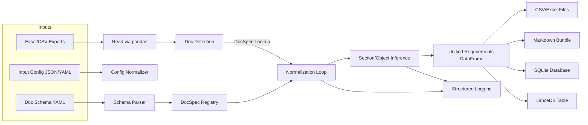

# Architecture Refactor Plan (YAML-Driven Single File)

## Objectives
- Externalize per-document schema rules into YAML while keeping `build_requirements_db.py` as a cohesive, well-documented script.
- Support automatic section/object inference when exports omit numbering data.
- Preserve existing outputs (CSV, Excel, Markdown, SQLite, optional LanceDB) with minimal behavioral change outside the new configuration flow.
- Strengthen logging, validation, and tests to cover the YAML-driven behaviors.

## Implementation Notes (2025-11-22)
- CLI now accepts `--schema-config` and propagates DocSpec metadata across normalization, Markdown, SQLite, and Markdown outputs.
- Default schema definitions mirror prior hard-coded expectations; YAML overrides merge on top of these defaults.
- Section/object inference helper now fills context based on section state or requirement IDs and is covered by regression tests.

## Guiding Constraints
- **Single-file core**: `build_requirements_db.py` remains the only execution module; new helpers live inside clearly labeled sections (e.g., `YAML CONFIG`, `NORMALIZATION PIPELINE`).
- **Backward compatibility**: Default behavior matches the prior hard-coded mappings when no external config is supplied.
- **Observable logging**: Continue using structured logging, emitting config provenance and inference decisions.
- **Test-first mindset**: Extend pytest coverage alongside each functionality shift to guard regressions.

## Target Enhancements

### 1. YAML Configuration Model
- **File layout**: Single YAML file with anchors/aliases to define a base schema and doc-specific overrides.
- **Schema keys**:
  - `doc_type`: canonical identifier (e.g., `FCSRD`).
  - `kind`: friendly label used in output (defaults to `doc_type`).
  - `required_columns`, `optional_columns`: lists of strings.
  - `id_columns`: ordered list describing potential requirement ID sources.
  - `text_columns`: ordered list of fields providing requirement text/header cues.
  - `trace_columns`: dict with `parents` and `children` arrays describing inbound/outbound link fields.
  - `section_detection`: optional block describing how to recognize headers (`type_column`, `header_types`, `object_number_column`).
  - `inference`: optional rules for deriving section/object numbers when missing (e.g., copy from last header and increment).
- **YAML example**:
  ```yaml
  base: &base
    section_detection:
      type_column: "Requirement Type"
      header_types: ["header", "heading", "section header"]
      object_number_column: "Object Number"
  documents:
    - doc_type: FCSRD
      <<: *base
      required_columns: ["Requirement ID", "Object Number", "Derived Requirement"]
      optional_columns: ["Derived Reqt Freighter", "Requirement Type", "Safety"]
      id_columns: ["Requirement ID"]
      text_columns: ["Derived Requirement", "Derived Reqt Freighter"]
      trace_columns:
        parents: ["Out-links (FSRD)", "Out-links (CSS)"]
        children: ["In-links (Control System Requirements)"]
    - doc_type: SRS
      required_columns: ["SRS Section", "Req't No", "Requirement Text"]
      id_columns: ["SRS Section", "Req't No"]
      text_columns: ["Requirement Text"]
      trace_columns:
        parents: ["Traceability Doc Reqd #", "Parent CSS ID"]
  ```

### 2. Config Loading & Validation
- Replace `DEFAULT_INPUT_CONFIG` with two layers:
  1. **Input document list** (existing JSON/YAML) describing paths/doc names.
  2. **Doc-type schema YAML** (new) optionally passed via CLI (`--schema-config`).
- Embed YAML parser inside script; fallback to built-in dict mirroring current schema tables when YAML absent.
- Validate YAML using lightweight checks:
  - Ensure `documents` is a list.
  - Cross-verify `doc_type` uniqueness.
  - Warn when optional columns listed but unseen in data.
- Cache parsed YAML in-memory to avoid repeated IO during normalization.

### 3. Normalization Flow Updates
- For each doc frame:
  - Derive `doc_kind` using YAML `doc_type` definitions (fallback to detector for legacy heuristics).
  - Reuse existing normalize_* functions but refactor inner logic to pull column lists and header rules from YAML-driven `DocSpec` objects.
  - Centralize shared routines (e.g., `collect_links`, `build_section_context`) inside the same file under a new "CONFIG-DRIVEN HELPERS" section.
- Maintain doc-specific nuances (e.g., FCSS derived requirement concatenation) while reading column names from config.
- Store config metadata (e.g., `spec.version`, default flags) in the combined dataframe for downstream logging.

### 4. Section/Object Inference
- Introduce helper `infer_section_context(row, state, spec)` that:
  - Applies existing header detection logic.
  - When a requirement lacks `Object Number`, reuse last known header or auto-increment numeric suffix if inference rule provided.
  - Annotate `Section_Inferred` boolean column plus log debug entries for each inference event.
- For SRS-like docs, allow fallbacks: if `Req't No` missing, take first value from `Requirement ID` token or derive sequence ID.

### 5. Output Enhancements
- **Markdown**: Add optional frontmatter fields `Schema_Version` and `Section_Inferred` when available.
- **SQLite**: Persist YAML-derived metadata in `extra_json` and extend `documents` table with `schema_version` column (default "builtin"). Provide migration guard to add column if DB exists with `--force-overwrite`.
- **Logging**: Emit summary of YAML origin, number of documents matched, and unresolved column references.

### 6. Testing Strategy
- Extend pytest suite with fixtures loading sample YAML doc specs.
- Add parametrized tests ensuring:
  - Missing column triggers validation error per YAML rules.
  - Section inference populates expected values when object numbers absent.
  - Normalization remains stable when YAML omitted (backward-compatible).
- Mock file system interactions via `tmp_path` for CLI tests covering `--schema-config` flag.

## Implementation Phases
1. **Bootstrap**
   - Add CLI flag and loader for schema YAML.
   - Serialize existing `DOC_TYPE_SCHEMAS` into default YAML dict to ensure fallback parity.
2. **Normalization Refactor**
   - Introduce `DocSpec` dataclass (inside script) constructed from YAML.
   - Update normalize functions to consume `DocSpec` instead of hard-coded sets.
3. **Inference Layer**
   - Implement reusable inference helper and integrate with FCSS/CSS/CSRD/SRS paths.
   - Emit new columns and logging.
4. **Outputs & Tests**
   - Adjust Markdown/SQLite exports, update tests, and add new fixtures.
5. **Documentation & QA**
   - Refresh README/progress notes, run pytest, and capture open issues for subsequent automation (e.g., LanceDB integration when YAML present).

## Mermaid Diagrams

### Script Architecture (Single File)
```mermaid
graph TD
    A[CLI Entry & Arg Parsing] --> B[Input Config Loader]
    B --> C[YAML Schema Loader]
    C --> D[DocSpec Cache]
    D --> E[Normalization Pipeline]
    E --> F[Combined DataFrame]
    F --> G[Flat File Exports]
    F --> H[Markdown Export]
    F --> I[SQLite Builder]
    F --> J[LanceDB Export (optional)]
    E --> K[Section/Object Inference Helper]
    C --> L[Schema Validation & Logging]
```

### Data Flow & Traceability

