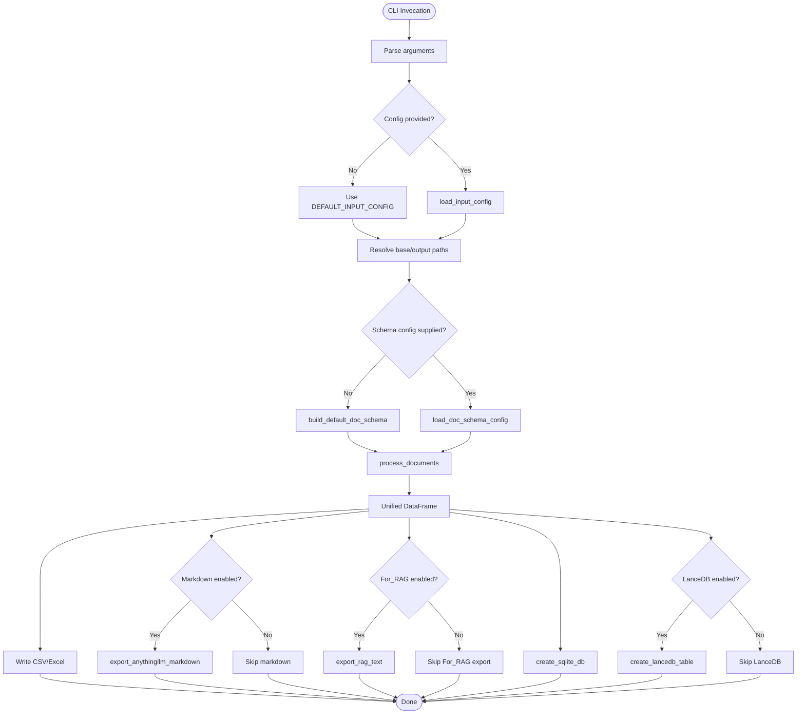
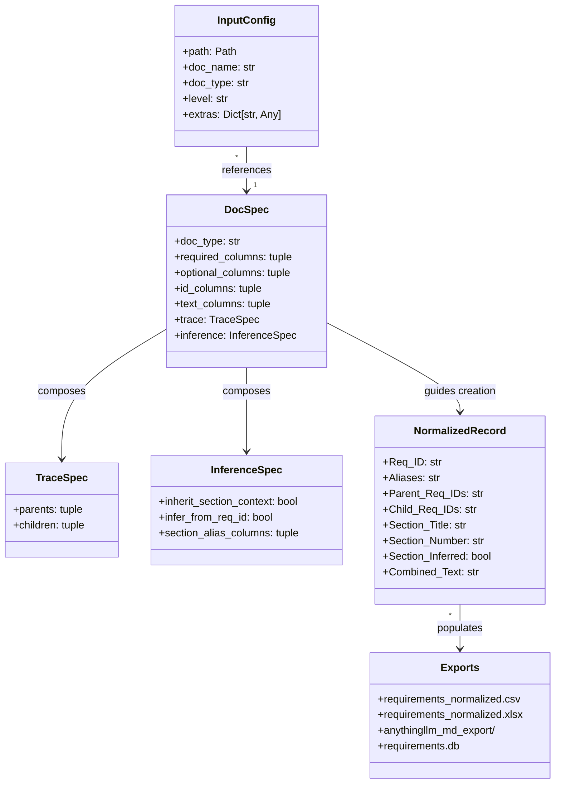
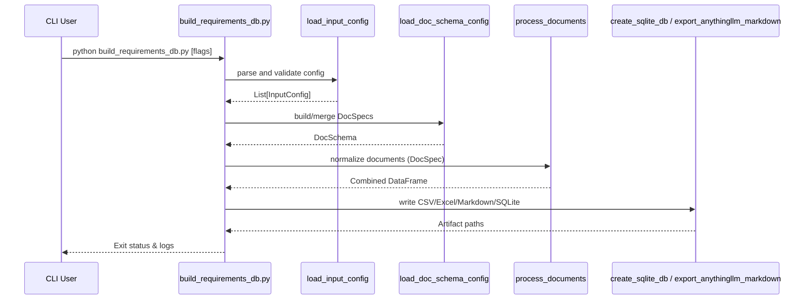

# File Flow & Modeling Guide

This guide visualizes the `build_requirements_db.py` workflow and explains the rationale behind the selected diagram types so readers can extend or adapt the model as the pipeline evolves.

## Diagram Selection Logic

- **Activity Diagram (AD)**: Choose when describing control flow or decision points between processing stages. It highlights the order of operations and branching paths (e.g., optional exports).
- **Block Definition Diagram (BDD)**: Use when clarifying the structural relationships among artifacts, inputs, and data products. BDDs emphasize composition, ownership, and key attributes rather than execution order.
- **Sequence Diagram**: Apply when you need to illustrate runtime interactions between collaborating functions or components, including message ordering and lifelines. Ideal for clarifying how helper routines cooperate during normalization.

## Activity Diagram – End-to-End Processing

This activity diagram captures control flow from CLI parsing through optional exports, including the new For_RAG branch, showing where defaults are used versus user-specified inputs.

## SysML BDD – Structural Relationships

The class-style diagram approximates a SysML Block Definition Diagram, emphasizing composition and multiplicity between configurations, schema metadata, normalized records, and exported artifacts.

## Sequence Diagram – Runtime Collaboration

This sequence diagram spotlights the message order between the CLI entry point and key helper functions, helping readers reason about extension points (e.g., inserting extra exports after normalization).

## Extending the Diagrams

- Introduce additional activity branches for new feature flags (e.g., REST export) when control flow changes.
- Expand the BDD with new blocks if schema metadata evolves (such as new inference strategies or trace relationships).
- Add lifelines to the sequence diagram when integrating asynchronous tasks or external services (for example, piping For_RAG artifacts into a queue).

Align new visuals with the selection logic above to keep the documentation consistent and maintainable.
