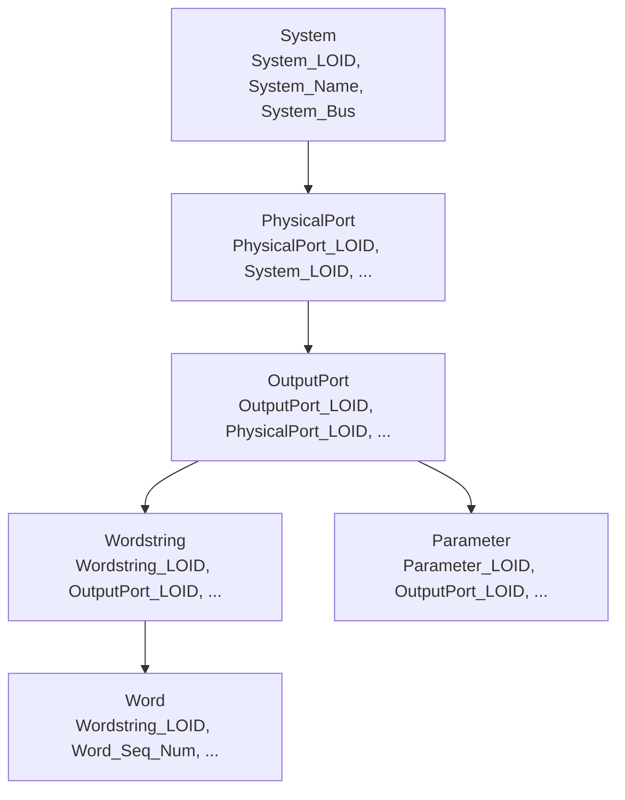

# ARINC-629 ICD Browser (Streamlit)

A Streamlit app to explore an ARINC-629 / ICD-style export from a single flat Excel sheet. The app normalizes the flat sheet in-memory with Polars and gives you a drill-down UI: **System → Physical Port → Output Port → Wordstring → Word & Parameter**.

## Quick start (interactive UI)

```bash
pip install -r icd_browser/requirements.txt
streamlit run icd_browser/icd_streamlit_app.py
```

- Provide a valid Excel path in the sidebar (default field) or upload a file via the uploader. The default path resolves to `sample_data/icd_flat_example.xlsx` relative to the repo root.
- The Excel sheet must include the column headers defined in `icd_data.py` (System, Physical Port, Output Port, Wordstring, Word, Parameter, and optional Report columns).

Common Streamlit CLI flags:
- `streamlit run icd_browser/icd_streamlit_app.py --server.port 8502` to set port.
- `streamlit run icd_browser/icd_streamlit_app.py --server.headless true` for headless.

## Using the UI

- Sidebar filters cascade automatically: choose a System to narrow Physical Ports, then Output Ports, then Wordstrings. Use **Clear filters** to reset.
- A search box filters Wordstring Name/Mnemonic and Parameter Name/Mnemonic while still respecting the hierarchy.
- Each table (Systems, Physical Ports, Output Ports, Wordstrings, Words, Parameters, Report) has:
  - Column chooser (persisted per session)
  - Download CSV of the current filtered/visible columns
  - Row counts reflected in headings and summary cards
- Optional column mapping: provide a JSON file in the sidebar to override source column names without touching code. A default template lives at `icd_browser/schema_mapping.json`.

## Data loading

- Default Excel path: edit the sidebar field (defaults to `sample_data/icd_flat_example.xlsx`; update to your file).
- File uploader: drop an `.xls`/`.xlsx` export and it will override the default path for the session.
- Data loading and normalization are cached for responsiveness; missing required columns are surfaced with clear errors.
- From the diff tool: you can point the browser at the normalized outputs emitted by `csv_excel_diff.py --export-normalized-left/--export-normalized-right`. The `.xlsx` exports include a `flat_filled` sheet plus per-table sheets; any of these files work as the input to the browser.

## Column mapping overrides (JSON)

You can rename source columns without code edits. The JSON shape mirrors the normalized tables; unspecified entries fall back to defaults:

```json
{
  "system": { "System_LOID": "System LOID LOID", "System_Name": "System Name NAME" },
  "physport": { "PhysicalPort_LOID": "A629 Physical Port Occ LOID LOID" },
  "outputport": { "OutputPort_Label": "A629 Output Port Label A629 Label" },
  "wordstring": {},
  "word": {},
  "parameter": {},
  "report": {}
}
```

Multiple presets are supported in one file; the UI lets you pick (and will auto-select the best match based on headers):

```json
{
  "presets": {
    "vendor_a": { "system": { "System_LOID": "Sys LOID" }, "physport": {}, "fill_down": ["Sys LOID"] },
    "vendor_b": { "system": { "System_LOID": "System Identifier" }, "physport": {} }
  },
  "default_preset": "vendor_b"
}
```

How to use:
1) Edit `icd_browser/schema_mapping.json` (or create a new JSON file).
2) In the sidebar, point "Mapping file path" to your JSON or upload it; uploaded takes precedence.
3) Restart/reload after edits (mappings are cached).

Forward fill (optional):
- Add `"fill_down": ["Raw Column A", "Raw Column B"]` inside a preset to forward-fill those raw columns (empty strings -> null -> forward fill) before normalization. This helps when parent rows are blank and should repeat down the table (e.g., System/Port IDs in flattened exports).

Shared schema/normalization:
- The canonical ICD schema, header cleaner, and fill-down defaults now live in `icd_common/` and are shared by the Streamlit browser and the legacy diff tool.
- Add or rename ICD columns in `icd_common/schema.py`; the browser and diff will pick up the change through the shared mapping utilities.
- Sidebar diagnostics in the app report row counts per stage so it is easy to see where rows drop if a mapping is incomplete.

Required vs optional columns:
- Required tables: system, physport, outputport, wordstring, word, parameter. All columns defined in their mappings must be present unless you remove them from the mapping.
- Optional: report table columns (`Database_DateTime`, `Col_59`, `Col_60`) are included when present.

## Typical use cases

- **Ad-hoc review:** Upload a new Excel export and drill down by system → wordstring → parameter; export filtered CSVs for offline notes.
- **Schema change trial:** Point to a custom mapping JSON when the upstream export renames columns; validate quickly without code changes.
- **Focused parameter search:** Apply system/port filters, then use the search box for parameter mnemonic/name; download just that slice.
- **Port capacity checks:** Filter by System or Physical Port and look at Output Port refresh rates and strike counts, with column hiding to focus on timing fields.

## Data model (SysML-like view)



## Also in this repo

Legacy CSV/Excel diff tooling is still present (see `csv_excel_diff.py` and related docs) if you need the earlier comparison workflows.
